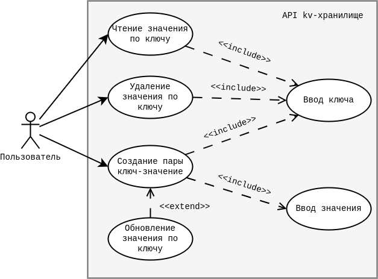
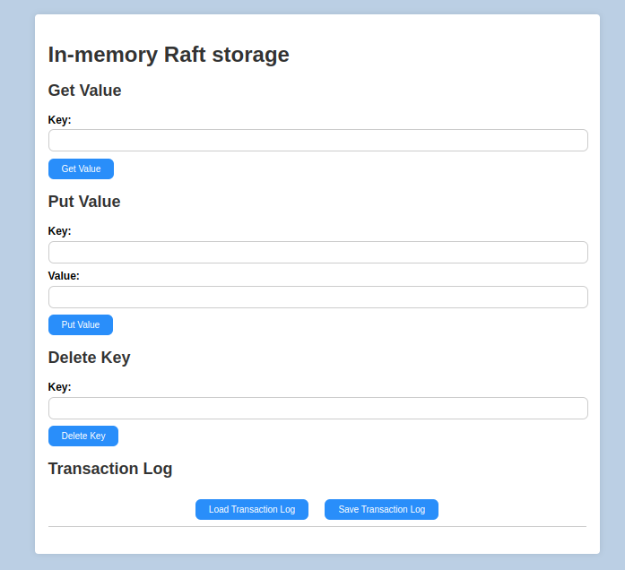

# In-memory Raft storage

**In-memory Raft storage** — представляет собой реализацию ключ-значение хранилища конфигураций с оперативной памяти с протоколом Raft. В общем случае, хранилище конфигураций служит для хранения и управления конфигурационными данными, необходимыми для работы распределенной системы.

**In-memory** технологии представляют собой механизмы хранения и вычислений в оперативной памяти. Они обеспечивают высокую производительность системы, за счет высокой скорости доступа к данным. С другой стороны, алгоритм консенсуса **Raft**, который обеспечивает отказоустойчивость и согласованность данных в распределенных системах. Именно благодаря комбинации этих двух технологий, в контексте исследований и дальнейшей разработки, позволит предложить новые более гибкие и отказоустойчивые решения для систем систем хранения и конфигурации данных.

**Можно выделить следующие ключевые особенности:**

- Обеспечение **эффективного хранения и управления** конфигурационными данными в оперативной памяти.
- Обеспечение **согласованности данных в кластере**, благодаря алгоритму консенсуса — Raft.
- Поддерживается управление и мониторинг состояний узлов кластера для обеспечения стабильной работы системы.
- Обеспечение **высокой производительности и высокой скорости доступа** к данным в условиях высоких нагрузок.

Диаграмма прецедентов хранилища:



## Установка и запуск хранилища

Для данной системы необходимы следующие обязательные **требования и компоненты**:

- Golang 1.21+

Для установки и запуска самого in-memory Raft хранилища склонируйте репозиторий или скачайте [пакетом](https://github.com/AlexPolarBear/In-memory-Raft-storage/archive/refs/heads/main.zip) и распакуйте.

Перейдите из корня проекта в директорию in-memory-Raft.

Для запуска основного узла введите команду в консоли:

```bash
go run ./cmd/app/in-memory-raft.go -haddr localhost:8080 -raddr localhost:7000 -id "node-name" "node0"
```

где 
  - `-haddr` — указывает на каком адресе будет запущен узел, по умолчанию `localhost:8000`.
  - `-raddr` — адрес непосредственно сервера, по умолчанию `localhost:7000`.
  - `-id` — уникальный идентификатор узла.
  - `"node0"` — указывает уникальное имя файла для сохранения снапшотов состояния узла.

После этой команды узел будет доступен по адресу `localhost:8080`, в том числе через браузер по API (см. "**Примеры использования**" ниже).

Теперь доступны весь основной функционал хранилища:

- Получение значения по ключу:

    ```bash
    GET localhost:8080/keys/{key}
    ```

- Добавление значения по ключу:

    ```bash
    POST localhost:8080/keys
    ```

    ```json
    {
        "key": "value"
    }
    ```

- Удаление пары ключ-значение по ключу:

    ```bash
    DELETE localhost:8080/keys/{key}
    ```

Для добавления узла в кластер, используйте следующую команду:

```bash
go run ./cmd/app/in-memory-raft.go -haddr localhost:8081 -raddr localhost:7001 -join localhost:8080 -id "follower-node" "node1"
```

Флаг `-join` указывает адрес узла кластера присоединяется "узел-последователь", в данном примере, к узлу по адресу `localhost:8080`.

*Важное замечание*: в данной реализации настроен функционал, при котором запросы на изменение данных принимаются только через лидерский узел. Узлы-фоловеры имеют доступ только к чтению данных.

## Примеры использования

Вот небольшой пример кода, демонстрирующий использование in-memory Raft storage:

```go
// Инициализация хранилища
store := NewStore()
mkDir, _ := os.MkdirTemp("", "some-storage")
defer os.RemoveAll(mkDir)

store.RaftBind = "localhost:8888"
store.RaftDir = mkDir

err := store.InitNode(true, "some-node")
if err != nil {
    log.Fatalf("Ошибка при создании узла: %s", err)
}

// Добавление значения
err := store.Put("ключ", "значение")
if err != nil {
    log.Fatalf("Ошибка при добавлении пары ключ-значение: %s", err)
}

// Получение значения
value, err = store.Get("ключ")
if err != nil {
    log.Fatalf("Ошибка при получении значения: %s", err)
}
fmt.Println("Полученное значение:", value)

// Удаление значения
err = store.Delete("ключ")
if err != nil {
    log.Fatalf("Ошибка при удалении значения: %s", err)
}
```

Здесь показаны базовые операции: инициализация хранилища, добавление, получение и удаление значений.

### API

Кроме использования кода, реализована взаимодействие с хранилищем при помощи HTTP API. Для более удобной демонстрации представлена следующая реализация интерфейса:



Описание API проекта in-memory Raft storage:

- **Get(key string) (string, error)**
  - Получает значение по ключу.
  - `key`: Ключ запрашиваемого значения.
  - Возвращает значение и `error` в случае неудачи.

- **Put(key string, value string) error**
  - Добавляет значение по указанному ключу.
  - `key`: Ключ для нового значения.
  - `value`: Значение, которое нужно сохранить.
  - Возвращает `error` в случае неудачи.

- **Delete(key string) error**
  - Удаляет значение по ключу.
  - `key`: Ключ удаляемого значения.
  - Возвращает `error` в случае неудачи.

- **Join(nodeID, addr string) error**
  - Добавление нового узла в кластер.
  - `nodeID`: Уникальный идентификатор для узла.
  - `addr`: Полный адрес для запуска узла.
  - Возвращает `error` в случае неудачи.

- **LoadTransactionLog() error**
  - Восстанавливает все сохраненные транзакции на узле.
  - Возвращает `error` в случае неудачи.

- **SaveTransactionLog() error**
  - Сохраняет историю транзакций.
  - Возвращает `error` в случае неудачи.

## Тестирование

### Unit-тесты

Написаны также на Golang и обычно имеют местоположение непосредственно в одном пакете с тестируемыми функциями. Они помечаются добавлением в конце названия `_test.go`.

Tесты запускаются командой: 

```bash
cd in-memory-raft/../..  # перейдите в каталог с тестом
go test run 
```

Если вы хотите запустить конкретный тест, используйте команду: 

```bash
go test -run НазваниеТеста
```

Вместе с Unit-тестами реализованы бенчмарки. Для их запуска использовалась команда:

```bash
go test -bench . -benchmem
```

### Автоматизированные тесты

Автоматизированные тесты реализованы с помощью [RobotFramework](https://robotframework.org/) и находятся в каталоге `tests`.

Для их запуска необходимы следующие **требования**:

- Python 3.9+
- pip

Установите необходимые библиотеки и инструменты с помощью команды из папки `tests`:

```bash
pip install -r requirements.txt
```

Тесты должны запускаться на запущенном тестовом стенде, параметры которого стоит уточнять в переменных теста. Для запуска тестов выполните команду:

```bash
robot НазваниеТестов.robot
```

### Нагрузочное тестирование

Помимо авто-тестов в каталоге `tests` находятся конфигурации для нагрузочного тестирования. Для одного узла — `load_leader.jmx` и для кластера из трех узлов — `load_nodes.jmx`.

Для их запуска необходимы следующие **требования**:

- JDK 8+
- Apache JMeter

Данные конфигурации загружаются через интерфейс JMeter, из которого настраиваются и запускаются. Параметры тестовых стендов также можно найти в конфигурации самих тестов.

## Как внести вклад

Стоит отметить, что разработанное решение полностью подлежит дальнейшему развитию для улучшения функциональности системы в целом. 

Буду признательна каждому, кто захочет внести свой вклад в развитие системы in-memory Raft storage. Вот несколько способов, как вы можете помочь:

### Сообщение об ошибках

Если вы нашли ошибку, пожалуйста, создайте issue в репозитории с подробным описанием проблемы. Чем больше информации вы предоставите, тем легче будет ее исправить:
- Описание ошибки
- Шаги для воспроизведения
- Ожидаемый результат
- Фактический результат
- Скриншоты (если применимо)

Помимо этого, вы можете сами предложить решение. Для этого, используйте следующий вариант действий:

### Предложение изменений

Если вы хотите предложить улучшение, начните с создания issue. После того, как issue будет одобрен вы можете приступить к работе, следуя этим шагам:
- Форкните репозиторий.
- Создайте новую ветку для ваших изменений.
- Сделайте изменения в вашей ветке.
- Отправьте pull request с подробным описанием ваших изменений.

### Правила и рекомендации

- **Тестирование**: Убедитесь, что все тесты проходят успешно перед отправкой pull request. Если тестового покрытия недостаточно для новой функциональности, возможно добавление и обновление тестовой базы.
- **Документация**: Обновите документацию, если ваши изменения требуют этого.
- **Безопасность**: Не допускайте конфликты в проекте, используйте рекомендуемые и проверенные версии библиотек и прочих инструментов.

## Контакты

Проект создан для учебного исследования, однако предполагает его дальнейшее развитие, поддержку улучшений и возможности для использования в реальных системах.

По всем вопросам и улучшения вы можете обращаться по информации, указанной в моем [профиле gitHub](https://github.com/AlexPolarBear).
